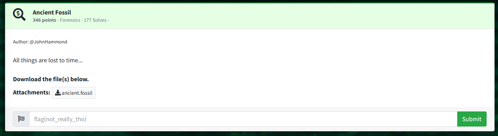

Ancient Fossil - Forensics  

Author: @JohnHammond  

All things are lost to time...  

Download the file(s) below.  
Attachments:   

ancient.fossil  


At first I thought the file was just a normal .SQLITE file according to Detect-It-Easy, so I opened it in an SQLite Viewer but was quickly overwhelmed.  
Noticed lots of base64 encoding, tried decoding but all unreadable.  
A Google search of "fossil" and "sqlite" reveals the proper method.  

$ sudo apt install fossil  
$ fossil open ancient.fossil  

```
└─$ fossil timeline       
=== 2024-10-16 ===
20:57:45 [e410648e20] *CURRENT* MTI5NDdmZTgzNTFkNTJkOGUxNWVlM2FhMzU1NDcyNTEK (user: kali tags: trunk)
20:57:45 [6f14e52d98] ZjNjZmU1MzUxNDdiMTA4M2UyYjU1OWRjZWY0NDhlNjIK (user: kali tags: trunk)
20:57:45 [984665383e] ZTRiOWNlMzJiZGZkN2MyOTQ0OTBmYWE2ZmUxZjYxMmEK (user: kali tags: trunk)
[...]
20:57:44 [24ec11d54b] OTQ2MTU2YzFjN2EwOTJmZjc0YjU5YTcxY2IwMjZiZmMK (user: kali tags: trunk)
--- line limit (20) reached ---
```

There are many commits, could potentially contain an encoded flag.  
Try moving through each commit manually, notice some do contain files.  
Both filename and file content as base64 encoded.  
Assume this is true for all possible files.  

We can write a script to automatically decode base64 from every available file, moving through each commit.  
Also tried a script to decode the base64 filenames instead, but this didn't lead anywhere.  

Focusing on decoding the base64 content of every file:  

Use fossil timeline -n 0 to show every line (403 commits)  

$ fossil time -n 0 | cut -d " " -f2 | tac > fossil_commits.txt  
Cleaned up in text editor.  

List of commits to iterate through:  
```
a6df33fb5e
47fcb20ec9
6fa037e021
[...]
e410648e20
```

Final solve script: fossil_auto_contents_solve.py  
Iterates through list, decoding base64 contents.  

```
[...]
Checking out commit: a3c1ff3113
Output from fossil co a3c1ff3113: NmY3ODc3YTcxODdkYmFkMjdiYzJiZWY3NDI0N2U3MTYK
Decoding contents of file: NmY3ODc3YTcxODdkYmFkMjdiYzJiZWY3NDI0N2U3MTYK
Decoded contents for NmY3ODc3YTcxODdkYmFkMjdiYzJiZWY3NDI0N2U3MTYK from commit a3c1ff3113: df29734adb29a99a2ecc5eed5c755a1c

Checking out commit: 0097222deb
No output for commit: 0097222deb

Checking out commit: f7c17864ce
Output from fossil co f7c17864ce: NWI3MTI2MjY1NGVhYzM3NjAzNDUzNzE3Y2NlMzYwNGEK
Decoding contents of file: NWI3MTI2MjY1NGVhYzM3NjAzNDUzNzE3Y2NlMzYwNGEK
Decoded contents for NWI3MTI2MjY1NGVhYzM3NjAzNDUzNzE3Y2NlMzYwNGEK from commit f7c17864ce: 476ca3e53513fc21cc1c958d166a1663

Checking out commit: a9c239cc4d
No output for commit: a9c239cc4d

Checking out commit: 5c1d602e0e
Output from fossil co 5c1d602e0e: NDQwMDE1MDZlY2ViMWJmZjRlNjI2M2M4OTU5YjBlMzUK
Decoding contents of file: NDQwMDE1MDZlY2ViMWJmZjRlNjI2M2M4OTU5YjBlMzUK
Traceback (most recent call last):
  File "/home/kali/Downloads/ancient_fossil/fossil_auto_contents_out.py", line 47, in <module>
    decoded_contents = decoded.stdout.decode().strip()
                       ^^^^^^^^^^^^^^^^^^^^^^^
UnicodeDecodeError: 'utf-8' codec can't decode byte 0xa0 in position 2: invalid start byte
```

Error occurs on one file because the content is already plaintext.  

> $ cat NDQwMDE1MDZlY2ViMWJmZjRlNjI2M2M4OTU5YjBlMzUK              
> flag{2ed33f365669ea9f10b1a4ea4566fe8c}

In hindsight, you can just iterate through every commit and cat the files since the flag was in plaintext.
