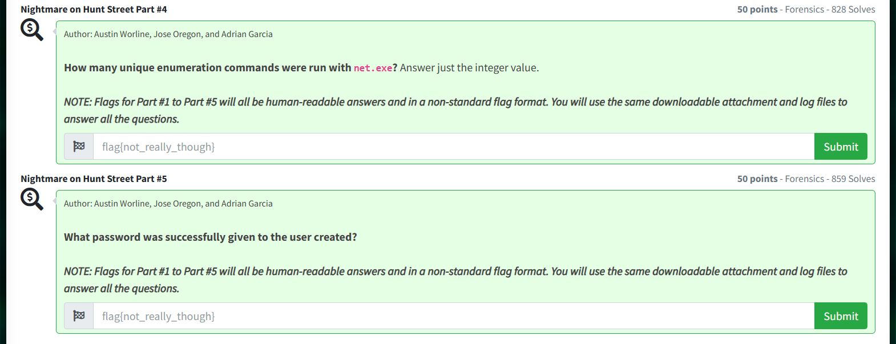

Nightmare on Hunt Street Parts 1 - 5

Authors: Austin Worline, Jose Oregon, and Adrian Garcia
```
##	NOTE: Flags for Part #1 to Part #5 will all be human-readable answers and in a non-standard flag format. 
##		You will use the same downloadable attachment and log files to answer all the questions.

##	logs-parts1-5.zip --> Application.evtx, Security.evtx, and System.evtx
##		All solutions derived from Security.evtx using Windows 10 Event Viewer.
```

1.	What is the IP address of the host that the attacker used?
2.	How many times was the compromised account brute-forced? Answer just the integer value.
3.	What is the name of the offensive security tool that was used to gain initial access? Answer in all lowercase.
4.	How many unique enumeration commands were run with net.exe? Answer just the integer value.
5.	What password was successfully given to the user created?

#### SOLUTIONS:
```
> 1.	"10.1.1.42"   # Search for IP address

> 2.	"32"          # Sort by time, count number of "Logon" event failures that occur before the first "Special Logon" aka successful attempt

> 3.	"psexec"      # Took 50+ guesses until psexec.py from Impacket: notice powershell is used, notice 8-char .exe names like "wgWMRHln" and "MrEQbpfX" are created

> 4.	"3"           # Export log to text file, filter by "Process Command Line", search "net ", count unique net commands: "user", "localgroup", and "share"

> 5.	"Susan123!"   # Same export and filter as before, find the latest line that adds new user with password

```
