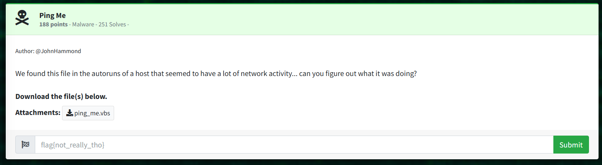

# Ping Me: Malware  

```ping_me.vbs```

vbs file, contains vbscript code  

https://www.onlinegdb.com/online_vb_compiler/  

```vbs
Module VBModule
    Sub Main()
        Console.WriteLine(
        chr(-8710+CLng(&H224A))&
		chr(CLng(&H1C3C)-7123)&
        chr(-1048+CLng(&H485))& 
		[...]
		chr(CLng(&H260D)-9625)
        )
    End Sub
End Module
```

https://www.online-python.com/  

```python 
print(
chr( - 8710 + int(0x224A))  + 
chr(int(0x1C3C) - 7123)  + 
chr( - 1048 + int(0x485))  + [...] )
```

Output:  
> Dim sh, ips, i:Set sh = CreateObject("WScript.Shell"):ips = Array("102.108.97.103", "123.54.100.49", "98.54.48.52", "98.98.49.98", "54.100.97.51", "50.98.56.98", "98.99.97.57", "101.50.54.100", "53.49.53.56", "57.125.35.35"):For i = 0 To UBound(ips):    sh.Run "cmd /Q /c ping " & ips(i), 0, False:Next  

Challenge is called "Ping Me". The file sends pings to 10 different IPs, and nothing further.  

Collect traffic in Wireshark.  
Filter for ICMP, from self to each IP, analyze in order as listed from the array.  

Search for hex "66 6c 61 67" aka 'flag': one match.  
Realize that each IP value is the decimal encoded flag.  
	aka 102 108 97 103 --> f l a g  
	
Decode each IP address in order to reveal the flag:  

> flag {6d1 b604 bb1b 6da3 2b8b bca9 e26d 5158 9}##  

> flag{6d1b604bb1b6da32b8bbca9e26d51589}  

