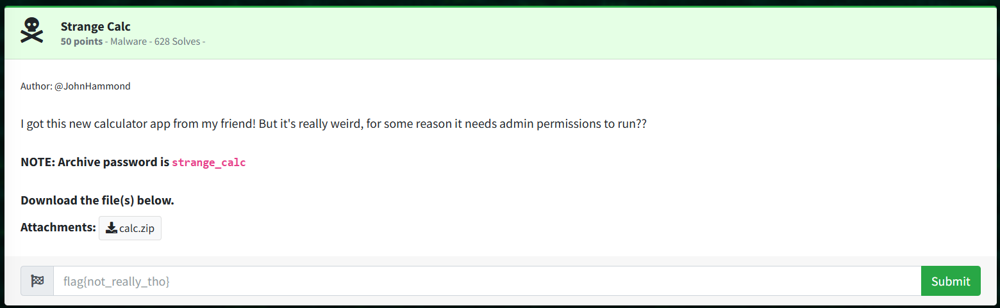

# Strange Calc: Malware  

Author: @JohnHammond  

I got this new calculator app from my friend! But it's really weird, for some reason it needs admin permissions to run??  

NOTE: Archive password is strange_calc  

Download the file(s) below.  
Attachments: --> ```calc.zip```  


## SOLUTION:  
extract calc.zip with password 'strange_calc' --> ```calc.exe```  

run usual commands: file, strings, binwalk, exiftool, etc.  
> file --> ```PE32 executable (GUI) Intel 80386, for MS Windows, UPX compressed```

> strings, exiftool --> see that calc.exe contains AutoIt v3.2.4.9 script  

download AutoIt v3.2.4.9 for the Exe2Aut tool -->  
(https://www.autoitscript.com/autoit3/files/archive/autoit/) (Windows)  

run Exe2Aut on calc.exe --> ```calc.au3```  
notice that the decompiled au3 script has one line of Base64  
CyberChef --> ```From Base64 > Microsoft Script Decoder```, output is JavaScript  

copy to online compiler, notice code will generate a string ```var c```  
remove extra code towards end: ```var o=["net user{...}Run(o[2],1,false);``` (unused in string generation)  
insert a console print just before the return line: ```console.log(c);return c.substring(0,g)```  

flag is output  
