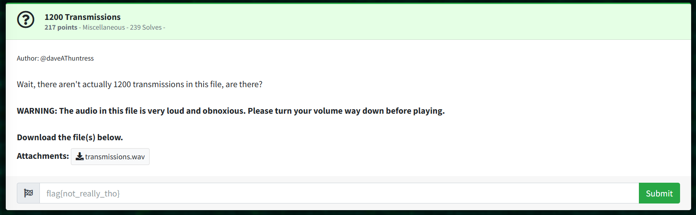

# 1200 Transmissions: Miscellaneous  

Author: @daveAThuntress  

Wait, there aren't actually 1200 transmissions in this file, are there?  

```WARNING: The audio in this file is very loud and obnoxious. Please turn your volume way down before playing.```  

Download the file(s) below.  
Attachments:  
```transmissions.wav```  

1200 in the context of audio transmissions is referring to 1200 baud.  

A 1200 baud wav file can be decoded with a tool like minimodem on Linux.  

> $ minimodem -f transmissions.wav 1200  
```
### CARRIER 1200 @ 1200.0 Hz ###
Greetings, Professor Falken. 

Would you like to play a game? 

flag{f28d133e7174c412c1e39b4a84158fa3}

Thanks for playing the Huntress CTF!

        @
       @@
       @@@@
  @@@@  @@@@@@  @@ @@@@@@@@
   @@@@@@ @@@@@@@   @  @  @@@@
     @@@@@@@@@@@@@@ @@@ @@   @@@
 @@@@@@# @@@@@@@@@@@ @@@@@@@@  @@@
  @@@@@@@@@@@@@@@@@@@@@@@@@@@@@ @@@
  @@         @@@@@@@@@@@@@@@     @@
  @@@@@@@@@@@@/@@@@@@@@@     @(~ @@
  @@    @@@@@@@@@@@ @@@@ @@@@  @@@
  @@@ @@@@.@@@@@@@@ @@@@@ @@@@  @@
   @@@  @@@*%@@@@ @@@ @@@@ @@@@@
     @@@    @   @@@@@@@@@ @@@@@
       @@@@.     @@@@@@@@ @@@@
           @@@@@@@@@ @@@@@ @@
                        @@
                         @ -dk

### NOCARRIER ndata=663 confidence=4.773 ampl=1.001 bps=1200.00 (rate perfect) ###
```
