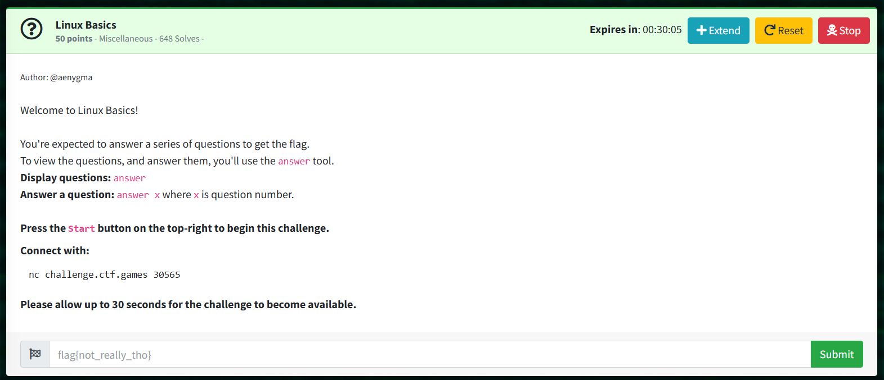

# Linux Basics: Miscellaneous  

Author: @aenygma  

Welcome to Linux Basics!  

You're expected to answer a series of questions to get the flag.  
To view the questions, and answer them, you'll use the ```answer``` tool.  
Display questions: ```answer```  
Answer a question: ```answer x``` where ```x``` is question number.  

Press the Start button on the top-right to begin this challenge.  

```
Question 0: What's your home directory?  
Question 1: Search the man pages. What command would you use to generate random permutations?  
Question 2: On what day was /home/user/myfile.txt modified? Use the date format 2019-12-31  
Question 3: How big is /home/user/myfile.txt, in kilobytes? Round to the nearest whole number.  
Question 4: What user owns the file /home/user/myfile.txt  
Question 5: What's the 3-digit octal permissions of the file /home/user/myfile.txt? (e.g 777)  
Question 6: What is the user id of 'admin'?  
Question 7: There is a user 'john' on the system. Can they write to /home/user/myfile.txt? (yes/no)  
Question 8: Can the 'admin' user execute /home/user/myfile.txt? (yes/no)  
Question 9: Which user on the system, except for you, root, admin and john, can execute /home/user/myfile.txt?  
Question 10: /home/user/myfile.txt looks like a txt file, but it actually isn't. What kind of file is it?
```

```
0 > /home/user
1 > shuf
2 > 1997-08-29
3 > 22
4 > root
5 > 754
6 > 1338
7 > no
8 > yes
9 > rose
10 > jpeg
```

> flag{8873fe66f8e7a6019d7d71261864f6c5}
