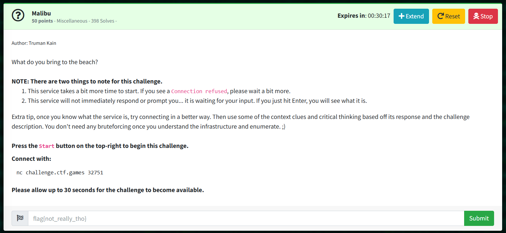

# Malibu: Miscellaneous  

Author: Truman Kain  

What do you bring to the beach?  

```
NOTE: There are two things to note for this challenge.  
This service takes a bit more time to start. If you see a Connection refused, please wait a bit more.  
This service will not immediately respond or prompt you... it is waiting for your input. If you just hit Enter, you will see what it is.  
Extra tip, once you know what the service is, try connecting in a better way. Then use some of the context clues and critical thinking based off its response and the challenge description. You don't need any bruteforcing once you understand the infrastructure and enumerate. ;)  
```

Press the Start button on the top-right to begin this challenge.  

#### Begin by connecting to the url, there was discussion that mentioned to use -v  
> $ curl GET http://challenge.ctf.games:31062/ -v    
```
* Could not resolve host: GET
* shutting down connection #0
curl: (6) Could not resolve host: GET
* Host challenge.ctf.games:31062 was resolved.
* IPv6: (none)
* IPv4: 35.193.148.143
*   Trying 35.193.148.143:31062...
* Connected to challenge.ctf.games (35.193.148.143) port 31062
> GET / HTTP/1.1
> Host: challenge.ctf.games:31062
> User-Agent: curl/8.9.1
> Accept: */*
> 
* Request completely sent off
< HTTP/1.1 403 Forbidden
< Accept-Ranges: bytes
< Content-Length: 254
< Content-Type: application/xml
< Server: MinIO
< Strict-Transport-Security: max-age=31536000; includeSubDomains
< Vary: Origin
< Vary: Accept-Encoding
< X-Amz-Id-2: dd9025bab4ad464b049177c95eb6ebf374d3b3fd1af9251148b658df7ac2e3e8
< X-Amz-Request-Id: 17FB601D2CAAF590
< X-Content-Type-Options: nosniff
< X-Ratelimit-Limit: 59
< X-Ratelimit-Remaining: 59
< X-Xss-Protection: 1; mode=block
< Date: Fri, 04 Oct 2024 22:22:40 GMT
< 
<?xml version="1.0" encoding="UTF-8"?>
* Connection #1 to host challenge.ctf.games left intact
<Error><Code>AccessDenied</Code><Message>Access Denied.</Message><Resource>/</Resource><RequestId>17FB601D2CAAF590</RequestId><HostId>dd9025bab4ad464b049177c95eb6ebf374d3b3fd1af9251148b658df7ac2e3e8</HostId></Error>  
```

Notice line "Server: MinIO":  
MinIO is an object storage system that uses buckets, like AWS S3  

"What do you bring to the beach?" -- a bucket  
> $ curl GET http://challenge.ctf.games:31062/bucket/ -v   
```
[...]
< HTTP/1.1 200 OK
< Accept-Ranges: bytes
< Content-Length: 45043
< Content-Type: application/xml
< Server: MinIO
[...]
```

> Saved output to bucket_dump.txt  

## SOLUTION 1:
Open bucket_dump.txt in Notepad++, find "<Key>", copy results to keys_dump.txt
Extract names of each key from dump, and download all data

One-liner to cut keys from keys_dump.txt
> $ cat keys_dump.txt | cut -d ">" -f 2 > keys_cut1 && cat keys_cut1 | cut -d "<" -f 1 > keys_cut.txt && rm -rf keys_cut1

Bash script to auto download from url using each key
> $ ./download_keys.sh

Open keys_downloaded folder and search for plaintext flag
> $ find . | grep -r -e "flag" 

## SOLUTION 2:
Download MinIO Client, and download all data
> $ wget https://dl.min.io/client/mc/release/linux-amd64/mc
> $ chmod +x mc
> $ mc alias set myminio/ http://challenge.ctf.games:31062/ admin ```[press Enter for no password]```

> $ mc ls myminio/bucket/
> $ mc cp --recursive myminio/bucket/ .

> $ find . | grep -r -e "flag" 
