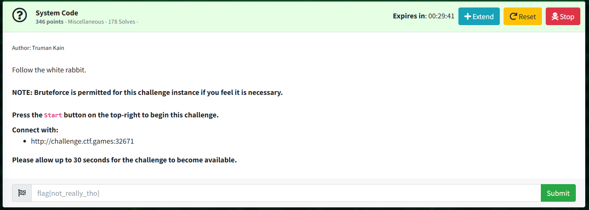

# System Code: Miscellaneous

Author: Truman Kain

Follow the white rabbit.

```NOTE: Bruteforce is permitted for this challenge instance if you feel it is necessary.```

Press the Start button on the top-right to begin this challenge.  
Connect with:  
http://challenge.ctf.games:30512  

## Solved by traceuse  

Open website, view source code, site requires some input for the flag, ```/enter=<input>```.  

Notice ```backupGlyphsTwr``` within ```config.js```, link ```"Twr"``` to ```"The white rabbit"```.  

Backup glyphs are ```["a", "b", "c", "d", "e", "f"]```, fuzz the input using abcdef chars.  

```
> $ crunch 6 6 abcdef -o system-code-abcdef.txt  

> $ ffuf -c -w system-code-abcdef.txt -u http://challenge.ctf.games:30512/enter=FUZZ -fs 60 -v -r  

        /'___\  /'___\           /'___\       
       /\ \__/ /\ \__/  __  __  /\ \__/       
       \ \ ,__\\ \ ,__\/\ \/\ \ \ \ ,__\      
        \ \ \_/ \ \ \_/\ \ \_\ \ \ \ \_/      
         \ \_\   \ \_\  \ \____/  \ \_\       
          \/_/    \/_/   \/___/    \/_/       

       v2.1.0-dev
________________________________________________

 :: Method           : GET
 :: URL              : http://challenge.ctf.games:30512/enter=FUZZ
 :: Wordlist         : FUZZ: /home/kali/Downloads/system-code-abcdef.txt
 :: Follow redirects : true
 :: Calibration      : false
 :: Timeout          : 10
 :: Threads          : 40
 :: Matcher          : Response status: 200-299,301,302,307,401,403,405,500
 :: Filter           : Response size: 60
________________________________________________

[Status: 200, Size: 66, Words: 6, Lines: 1, Duration: 427ms]
| URL | http://challenge.ctf.games:30512/enter=bfdaec
    * FUZZ: bfdaec
```

> I am flabbergasted by how simple the final solution path was compared to all of the rabbit holes I took to not get there.
