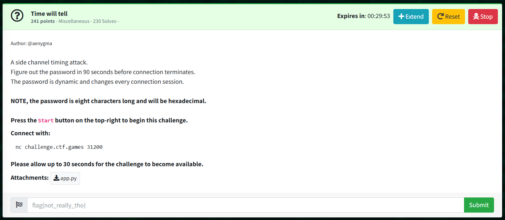

# Time will tell: Miscellaneous  

Author: @aenygma  

A side channel timing attack.  
Figure out the password in 90 seconds before connection terminates.  
The password is dynamic and changes every connection session.  

```NOTE, the password is eight characters long and will be hexadecimal.```  

Press the Start button on the top-right to begin this challenge.  
Attachments:  

```app.py```  

## SOLUTION:  
#### Write a python script using pwntools to connect to the server and conduct a timing attack.  

password is 8 hex chars  
we can brute force guesses starting from length 1, and whenever the server 'lags', it can be interpreted as a hit on a correct password guess.  

testing showed that incorrect guesses had a common latency,  
but a correct guess would be 0.1 sec relatively slower.  
this matches the simulated compute time found in the source code after a correct guess.  

start by guessing every hex char 0-9,a-f and incrementing guess length until password length 8.  
fill with padding to match pw len 8 for consistency.  

establish proper timing through use of a baseline and comparing changes in latency to the baseline.  
baseline can be the average latency of several consecutive guesses, set up before the attack.  
then we can calculate a delta, or change in latency, using the baseline to determine correct guesses (highest delta).  

my solve involved using the first two deltas in a set of guesses to calculate a common delta,
then compare subsequent guess deltas to the common delta.  
if delta > threshold, accept guess and continue  
this optimization skips unnecessary guesses to achieve the final sub-90-second solve time.  

some code cleanup required to get consistent and accurate deltas (send empty guesses, adjust delta based on pw pos)  

also added multiple guess attempts averaging to a single delta, to mitigate false positives, but only needed max 2 attempts per guess in the end.  

example idealized guess sequence (pw len = 3):  
```
try:     delta:
000       0.0
100       0.0
200       0.0
300       0.0
400       0.0
500       0.1
> accept guess 5
500       0.0
510       0.0
520       0.0
530       0.1
> accept guess 53
530       0.0
531       0.1
> accept guess 531
...
> final password guess: 531
```

## timing_attack_solve.py
