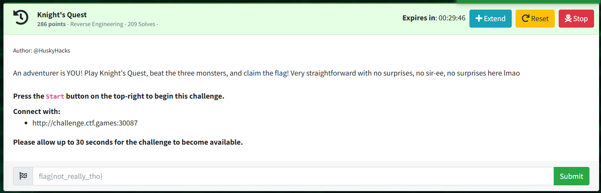
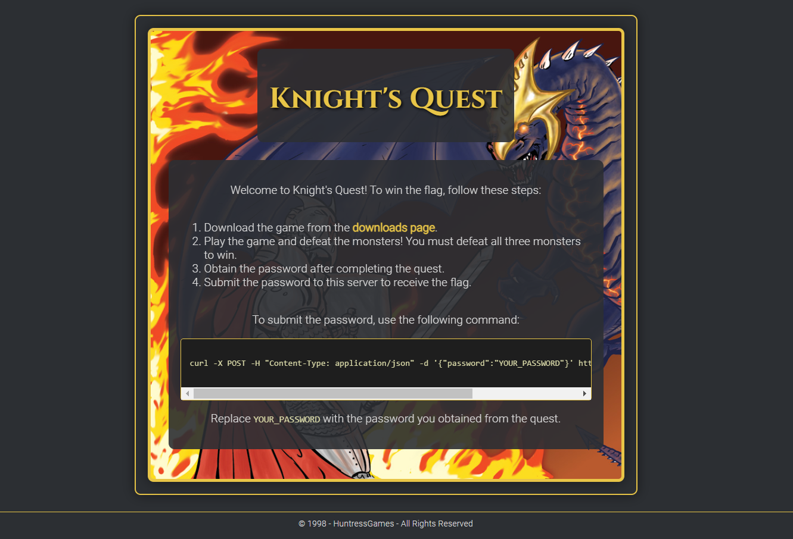

Knight's Quest - Reverse Engineering

Author: @HuskyHacks

An adventurer is YOU! Play Knight's Quest, beat the three monsters, and claim the flag! Very straightforward with no surprises, no sir-ee, no surprises here lmao



```
Knight's Quest
Welcome to Knight's Quest! To win the flag, follow these steps:

Download the game from the downloads page.
Play the game and defeat the monsters! You must defeat all three monsters to win.
Obtain the password after completing the quest.
Submit the password to this server to receive the flag.
To submit the password, use the following command:

> curl -X POST -H "Content-Type: application/json" -d '{"password":"YOUR_PASSWORD"}' http://[CHALLENGE_URL:PORT]/submit
                        
Replace YOUR_PASSWORD with the password you obtained from the quest.

Available Downloads
.gitkeep
knights_quest_windows.exe
knights_quest_linux
knights_quest_macos
```

File: knights_quest_linux

```
$ ./knights_quest_linux

    __ __ _   ______________  _________ _____    ____  __  ___________________
   / //_// | / /  _/ ____/ / / /_  __( ) ___/   / __ \/ / / / ____/ ___/_  __/
  / ,<  /  |/ // // / __/ /_/ / / /  |/\__ \   / / / / / / / __/  \__ \ / /   
 / /| |/ /|  // // /_/ / __  / / /    ___/ /  / /_/ / /_/ / /___ ___/ // /    
/_/ |_/_/ |_/___/\____/_/ /_/ /_/    /____/   \___\_\____/_____//____//_/            

~~~~~~~~~~~~~~~~~~~~~~~~~ An Adventurer Is You! ~~~~~~~~~~~~~~~~~~~~~~~~~ 


[start/exit] > 
```


```
+--------------------------------------------------------------------------------+
| 🛡                                     | 🕷                                     |
| -------------------------------------- | -------------------------------------- |
| Player                                 | Spider                                 |
| ❤: 99/99                              | ❤: 30/30                              |
| ⚔: 10                                 | ⚔: 5                                  |
| 🏃: 50                                  | 🏃: 20                                  |
+--------------------------------------------------------------------------------+

Messages:
> A wild Spider appears!
--------------------------------------------------------------------------------
[attack/defend] > 
```

Play game through terminal locally.  
Gameplay is 'attack' or 'defend' and there are only 3 levels ending with an 'impossible' final boss.  
Goal for this challenge is to modify the code to beat the boss, obtain the password, and get the flag.  

```
+--------------------------------------------------------------------------------+
| 🛡                                     | 🐍                                      |
| -------------------------------------- | -------------------------------------- |
| Player                                 | Gorthmog, Destroyer Of Worlds          |
| ❤: 29/99                              | ❤: 999999999/999999999                |
| ⚔: 10                                 | ⚔: 999999999                          |
| 🏃: 50                                  | 🏃: 1                                   |
+--------------------------------------------------------------------------------+

Messages:
> It's the Ogre's turn.
> The Ogre attacked you for 15 damage!
> You attacked the Ogre for 10 damage!
> You have defeated the Ogre!
> A wild Gorthmog, Destroyer Of Worlds appears!
--------------------------------------------------------------------------------
[attack/defend] > 
```

Open IDA Free or Ghidra.  
Find logic that deals with what happens after player inputs 'attack' or 'defend'.  
See knightsquest_round_playerTurn.  

Logic to determine what happens next after player action depends on a single line:  
> jg     loc_498093 ; jump if greater than  
Will jump to further round logic or to "You have defeated" function.  

Patch line to:  
> jle    loc_498093 ; jump if less than or eq  
Force the jump directly to "You have defeated" regardless of player input.  

Assemble the patch and play game again.  
Beat every enemy instantly, and password is granted after the boss.  

```
+--------------------------------------------------------------------------------+
| 🛡                                     |                                        |
| -------------------------------------- | -------------------------------------- |
| Player                                 |                                        |
| ❤: 99/99                              | ❤: 0/0                                |
| ⚔: 10                                 | ⚔: 0                                  |
| 🏃: 50                                  | 🏃: 0                                   |
+--------------------------------------------------------------------------------+

Messages:
> You have defeated the Ogre!
> A wild Gorthmog, Destroyer Of Worlds appears!
> You brace yourself for incoming attacks!
> You have defeated the Gorthmog, Destroyer Of Worlds!
> Congratulations! You have defeated all enemies!
--------------------------------------------------------------------------------
Your flag submission password is: hmafgAhAalqmQABBOAZtP3OWFegsQDAB
Press enter to exit the game...
```

Send password to the server according to instructions for the flag.  

```
$ curl -X POST -H "Content-Type: application/json" -d '{"password":"hmafgAhAalqmQABBOAZtP3OWFegsQDAB"}' http://challenge.ctf.games:32344//submit 
{"flag":"flag{40b5b7e5395ee921cbbc804d4350b9c1}"}
```
