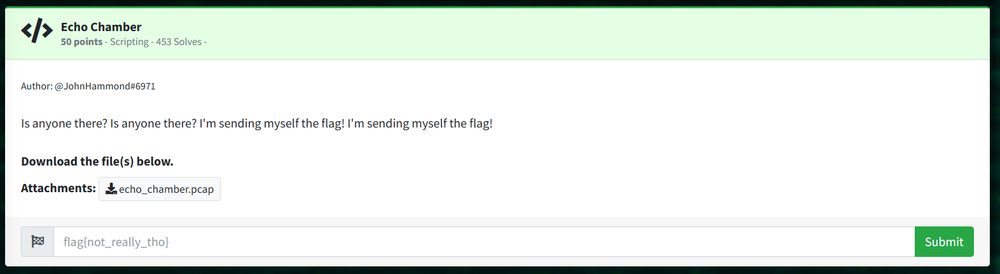

# Echo Chamber: Reverse Engineering  

```echo_chamber.pcap```

Open in Wireshark:  

File > Export Packet Dissections > out1.txt  

> $ cat out1.txt | grep -e "0000  " | cut -d " " -f3 > out2.txt  

Appears to be hex data, and "89 50 4E 47" matches the magic bytes for a PNG (but isn't needed to solve the challenge)

Load data into CyberChef, convert From Hex:  
> https://gchq.github.io/CyberChef/#recipe=From_Hex('Auto')&input=MmUNCjc0DQo3NA0KNDUNCjQ1DQo1OA0KNTgNCjc0DQo3NA0KNjMNCjYzDQo2MQ0KNjENCjcwDQo3MA0KNzQNCjc0DQo2OQ0KNjkNCjZmDQo2Zg0KNmUNCjZlDQowMA0KMDANCjY2DQo2Ng0KNmMNCjZjDQo2MQ0KNjENCjY3DQo2Nw0KN2INCjdiDQozNg0KMzYNCjYyDQo2Mg0KMzMNCjMzDQozOA0KMzgNCjYxDQo2MQ0KNjENCjYxDQozOQ0KMzkNCjMxDQozMQ0KMzcNCjM3DQo2MQ0KNjENCjM3DQozNw0KMzUNCjM1DQozNA0KMzQNCjY0DQo2NA0KMzgNCjM4DQo2Mg0KNjINCjY2DQo2Ng0KMzMNCjMzDQozOA0KMzgNCjM0DQozNA0KNjQNCjY0DQo2Mw0KNjMNCjM3DQozNw0KMzMNCjMzDQo2Ng0KNjYNCjY0DQo2NA0KNjUNCjY1DQozNg0KMzYNCjMzDQozMw0KMzMNCjMzDQo2MQ0KNjENCjY0DQo2NA0KN2QNCjdkDQo3Mw0KNzMNCjQ0DQo0NA0KZDgNCmQ4DQo3Zg0KN2YNCjAwDQowMA0KMDANCjAwDQowMA0KMDANCjBmDQowZg0KNzQNCjc0DQo0NQ0KNDUNCjU4DQo1OA0KNzQNCjc0DQo2Mw0KNjMNCjYxDQo2MQ0KNzANCjcwDQo3NA0KNzQNCjY5DQo2OQ0KNmYNCjZmDQo2ZQ0KNmUNCjNhDQozYQ0KNmMNCjZjDQo2OQ0KNjkNCjZlDQo2ZQ0KNjUNCjY1DQo3Mw0KNzMNCjAwDQowMA0KMzENCjMxDQphOA0KYTgNCjA3DQowNw0KM2QNCjNkDQo5MQ0KOTENCjAwDQowMA0KMDANCjAwDQowMA0KMDANCjAwDQowMA0KNDkNCjQ5DQo0NQ0KNDUNCjRlDQo0ZQ0KNDQNCjQ0DQphZQ0KYWUNCjQyDQo0Mg0KNjANCjYwDQo4Mg0KODINCg&ieol=CRLF&oeol=VT

```
[...TRUNCATED...]
..ttEEXXttccaappttiioonn ffllaagg{{66bb3388aaaa991177aa775544dd88bbff338844ddcc7733ffddee663333aadd}}ssDDØØ
```

> Clean up repeated characters in the flag
