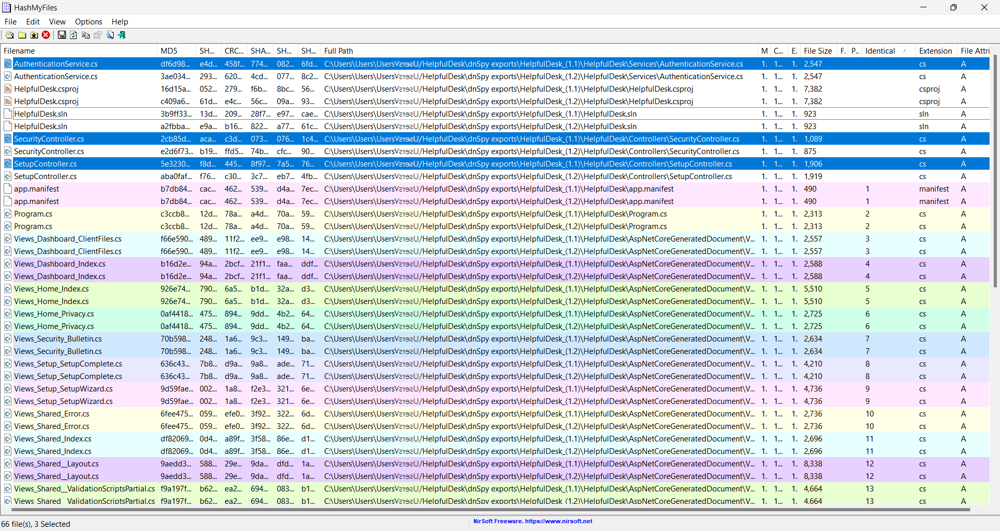
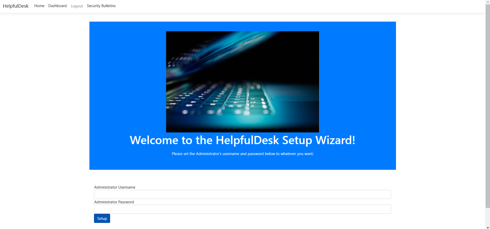
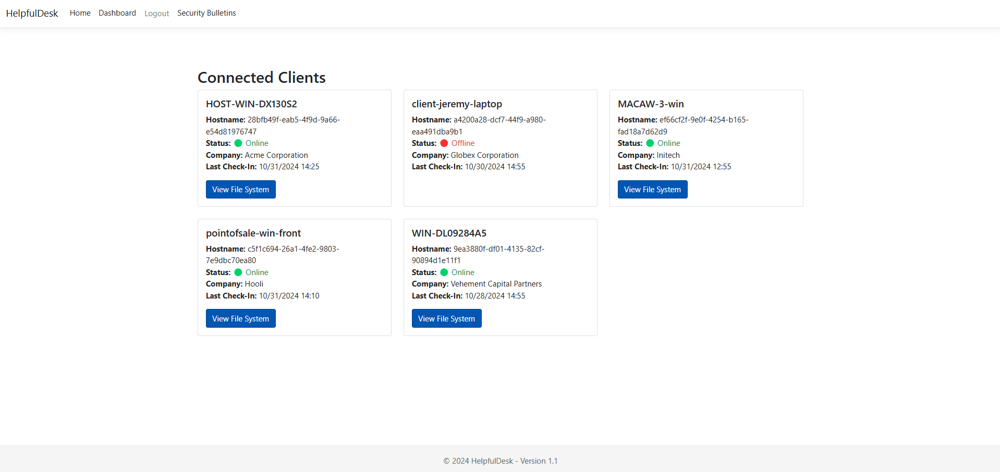
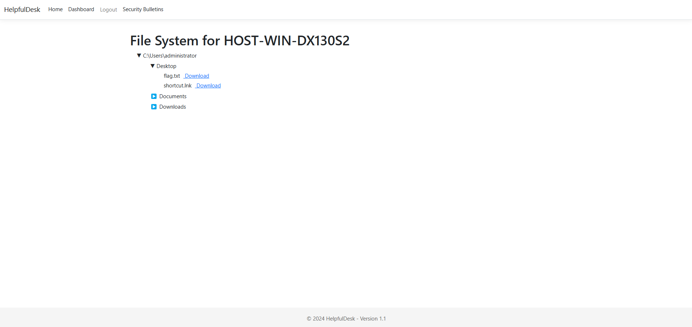

# HelpfulDesk: Web  

Author: @HuskyHacks  

HelpfulDesk is the go-to solution for small and medium businesses who need remote monitoring and management. Last night, HelpfulDesk released a security bulletin urging everyone to patch to the latest patch level. They were scarce on the details, but I bet that can't be good...  

Press the Start button on the top-right to begin this challenge.  

> http://challenge.ctf.games:32350  


notice that the web server is running on v1.1  
download the source code from the 3 listed versions  
examine files, find differences using HashMyFiles  


```
HelpfulDesk-1.0.dll  
HelpfulDesk-1.1.dll  
HelpfulDesk-1.2.dll
```

focus on current version (1.1) and patched version (1.2) dlls  

file is a .NET program, decompile to C# code using dnSpy  
open each dll in dnSpy and Export to Project  
find differences using HashMyFiles  



```
AuthenticationServices.cs  
SecurityController.cs  
SetupController.cs
```

review differences in code for each file between both versions  

> HelpfulDesk_(1.1)\HelpfulDesk\Controllers\SetupController.cs  
```c#
		// Token: 0x060000F9 RID: 249 RVA: 0x000041E0 File Offset: 0x000023E0
		public IActionResult SetupWizard()
		{
			if (File.Exists(this._credsFilePath))
			{
				string requestPath = base.HttpContext.Request.Path.Value;
				if (requestPath.Equals("/Setup/SetupWizard", StringComparison.OrdinalIgnoreCase))
				{
					return this.View("Error", new ErrorViewModel
					{
						RequestId = "Server already set up.",
						ExceptionMessage = "Server already set up.",
						StatusCode = 403
					});
				}
			}
			return this.View();
		}
```

> HelpfulDesk_(1.2)\HelpfulDesk\Controllers\SetupController.cs
```c#
		// Token: 0x060000F9 RID: 249 RVA: 0x000041AC File Offset: 0x000023AC
		public IActionResult SetupWizard()
		{
			if (File.Exists(this._credsFilePath))
			{
				string requestPath = base.HttpContext.Request.Path.Value.TrimEnd('/');
				if (requestPath.Equals("/Setup/SetupWizard", StringComparison.OrdinalIgnoreCase))
				{
					return this.View("Error", new ErrorViewModel
					{
						RequestId = "Server already set up.",
						ExceptionMessage = "Server already set up.",
						StatusCode = 403
					});
				}
			}
			return this.View();
		}
```

> "string requestPath = base.HttpContext.Request.Path.Value.TrimEnd('/');"  

the security patch was to prevent navigation to the setupwizard after the server is already running.  
in 1.1, the vulnerability can be exploited by navigating to "/Setup/SetupWizard/" instead of "/Setup/SetupWizard"  

> http://challenge.ctf.games:32350/Setup/SetupWizard/  

create new account, overriding the server and gaining access  




