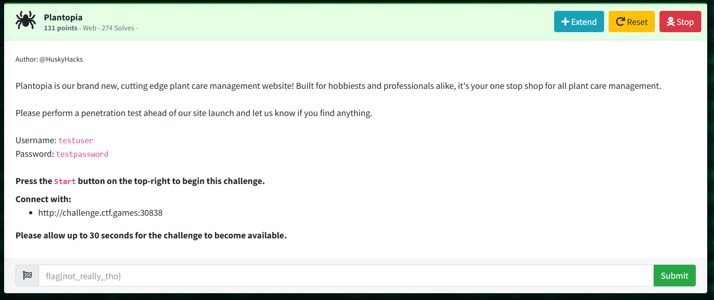
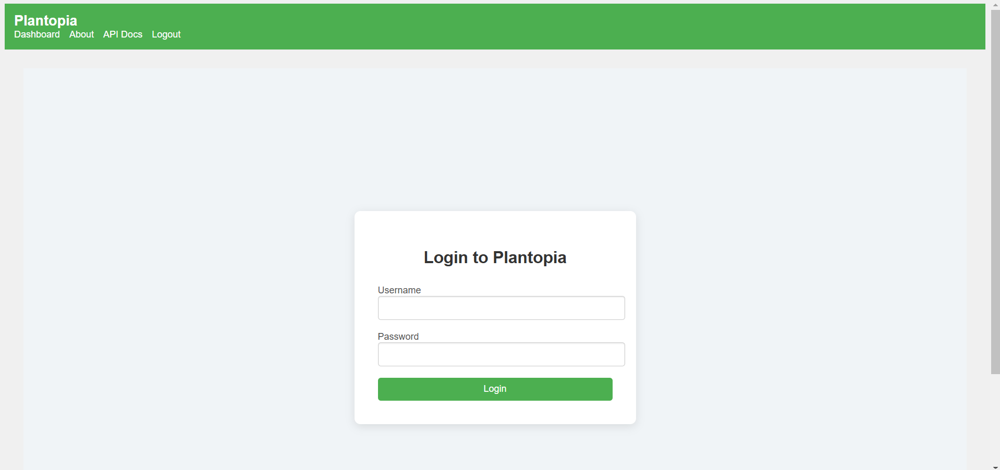
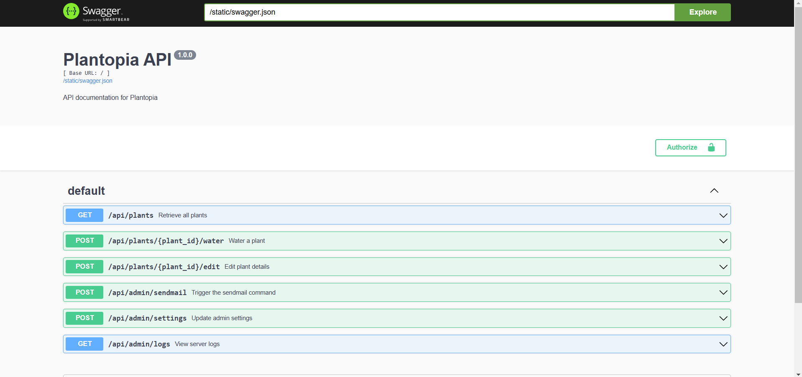
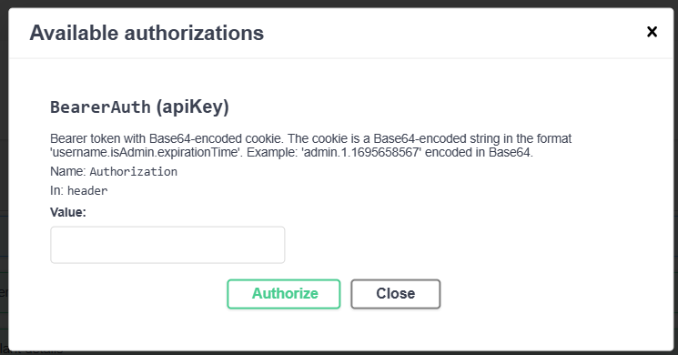
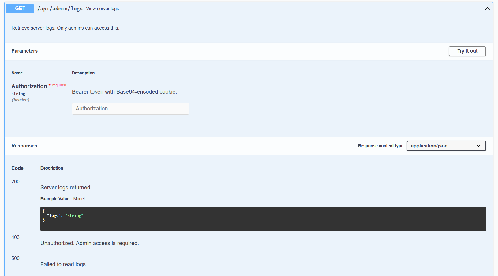
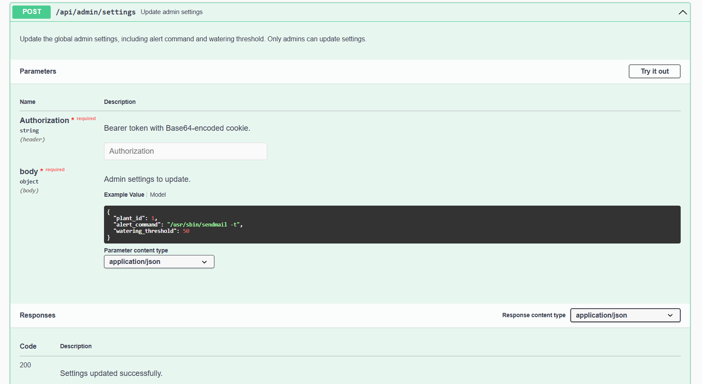
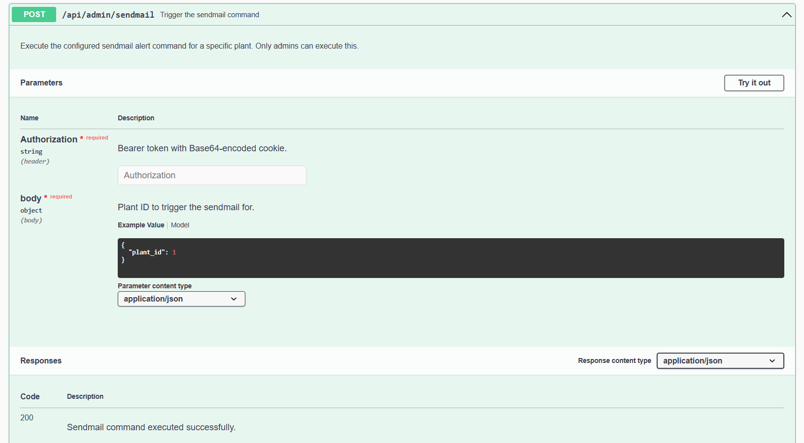
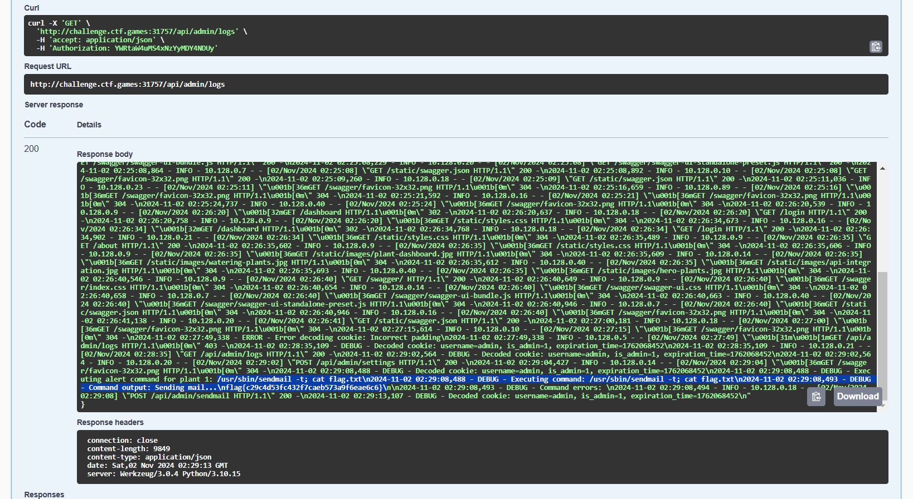

# Plantopia

> Login page

> Dashboard

> API Docs

> Ability to authorize as admin by entering a valid Base64 apiKey.  
> The expiration time is any future date in Unix timestamp format.  

> Authorize as admin to view logs.  
> Can view the output of executed commands.  

> Built-in sendmail command is vulnerable to pass anything as long as sendmail is included.  
> "/usr/sbin/sendmail -t; cat flag.txt"

> Trigger the sendmail command that we have modified to include our payload.

> View logs and retrieve the flag.

